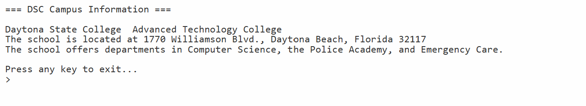

# 🏫 DSC Campus — C# Inheritance Demo

A C# (.NET Core 3.1) console application that models a college campus
system using object-oriented inheritance. A base `DSC` class defines
shared school information and a virtual address method, while the derived
`Campus` class overrides it to provide campus-specific details.

---

## 📋 Features

- `DSC` base class defines the school name and a virtual `GiveAddress()`
  method with the main campus address
- `Campus` derived class inherits from `DSC` and overrides `GiveAddress()`
  to return a campus-specific address
- `Campus` overrides `ToString()` to produce a full formatted summary
  including school name, campus name, address, and departments
- Demonstrates the "is-a" relationship — a `Campus` is a `DSC`
- Shows virtual method overriding in a real-world context

---

## ⚙️ How It Works

- `DSC` is the base class — it holds the school name and provides a
  default address through the virtual `GiveAddress()` method
- `Campus` extends `DSC` — it stores a campus name and overrides
  `GiveAddress()` to return its own specific address
- `Campus` also overrides `ToString()` combining the inherited
  `GetSchoolName()` with its own campus data for a complete summary
- `Program.cs` creates a `Campus` object and calls `ToString()` which
  automatically uses the overridden methods at runtime

---

## 💡 Example Output

```
=== DSC Campus Information ===

Daytona State College  Advanced Technology College
The school is located at 1770 Williamson Blvd., Daytona Beach, Florida 32117
The school offers departments in Computer Science, the Police Academy, and Emergency Care.

Press any key to exit...
```

---

## 🛠️ Technologies Used

| Technology        | Purpose                                               |
|-------------------|-------------------------------------------------------|
| C# 8.0            | Core programming language                             |
| .NET Core 3.1     | Runtime framework                                     |
| Inheritance       | `Campus` extends `DSC` base class                     |
| Virtual Methods   | `GiveAddress()` defined in base, overridden in derived |
| Method Overriding | `ToString()` overridden for formatted output          |
| OOP Properties    | `CampusName` property replacing old getter/setter     |

---

## 🎓 Learning Outcomes

- Defining a base class with shared data and virtual methods
- Extending a base class using inheritance (`class Campus : DSC`)
- Overriding virtual methods with the `override` keyword
- Calling inherited methods from a derived class (`GetSchoolName()`)
- Understanding how method overriding is resolved at runtime
- Using `ToString()` override to produce meaningful object output

---

## 📁 Folder Structure

```
A9-Inheritance-/
├── Campus.cs           ← Derived class — overrides address and ToString
├── DSC.cs              ← Base class — school name and default address
├── Program.cs          ← Runner — creates Campus and prints output
├── A9-screenshot.png   ← Console output screenshot
├── A9.csproj
├── .gitignore
├── LICENSE
└── README.md
```

---

## 🚀 How to Run

### Prerequisites
- [.NET Core 3.1 SDK](https://dotnet.microsoft.com/download/dotnet/3.1)

### Steps

```bash
# Clone the repository
git clone https://github.com/MissMarzelous/A9-Inheritance-.git

# Navigate into the project folder
cd A9-Inheritance-

# Run the application
dotnet run
```

---

## 📸 Screenshots

### Console Output



---

## 👩‍💻 Author

**MissMarzelous** — C# .NET Core student project
